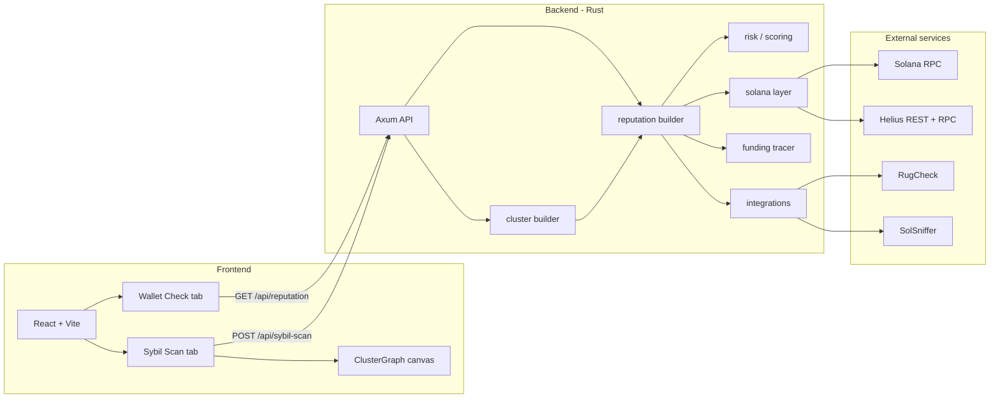

# WalletGuard — Project Documentation

WalletGuard is a **Solana wallet reputation / trust scoring** tool. You paste a wallet address (or a batch of addresses), the backend analyzes on-chain behavior (and optional third-party token scans), and the UI shows a **1–100 trust score**, a **branded label** (Unverified → Guardian), per-metric risk breakdowns, **funding-source classification**, and **sybil cluster detection** for batch scans.

The product direction is a **sellable reputation API** (`walletguard-v1`); the web app is a preview/demo client.

---

## What it does

| Capability | Description |
|------------|-------------|
| **Wallet check** | Validates a base58 Solana address and builds a full reputation report. |
| **Trust score** | Internal raw score (0–1400) mapped to a public **1–100** score plus a trust label. |
| **Risk metrics** | Eight parameters (age, tx count, bursts, spacing, balance, NFTs, tokens, DeFi) each rated `low` / `medium` / `high`. |
| **Funding source** | Traces the oldest tx and classifies the first SOL inflow sender as `cex`, `bridge`, `wallet`, or `unknown`. |
| **Sybil scan** | Batch scan up to **50** addresses; groups wallets that share the same funding address into clusters. |
| **Improvement hints** | Actionable steps for metrics that are not low risk (except wallet age). |
| **Token scans** | Optional RugCheck + SolSniffer on a sample of held SPL mints. |
| **Session history** | Last 5 single-wallet checks stored in the browser (`sessionStorage` only). |
| **Network graph** | Canvas visualization of clusters and clean wallets on the Sybil Scan tab. |
| **On-chain program** | Separate Anchor program (`walletguard/`) to store scores on-chain — **not wired to the live API/UI yet**. |

---

## High-level architecture



---

## Repository layout

```
solana-walletguard/
├── backend/                 # Rust API (walletguard-api)
│   ├── src/
│   │   ├── main.rs          # Server, routes, AppState, CORS
│   │   ├── config.rs        # Env / scan modes / rate limits
│   │   ├── analysis/
│   │   │   ├── reputation.rs
│   │   │   ├── cluster.rs   # In-memory funder clustering
│   │   │   ├── risk.rs
│   │   │   └── improvements.rs
│   │   ├── integrations/
│   │   ├── models/
│   │   ├── routes/
│   │   │   ├── wallet.rs    # GET /api/reputation
│   │   │   └── sybil.rs     # POST /api/sybil-scan
│   │   └── solana/
│   │       ├── rpc.rs       # JSON-RPC + global concurrency gate
│   │       ├── wallet.rs
│   │       ├── transactions.rs
│   │       ├── helius.rs
│   │       └── funding.rs   # First SOL inflow / CEX–bridge labels
│   ├── .env.example
│   └── Cargo.toml
├── frontend/
│   ├── vite.config.ts       # Dev proxy /api → backend
│   └── src/
│       ├── App.tsx          # Tabs: Wallet Check | Sybil Scan
│       ├── components/
│       │   ├── MetricRow.tsx
│       │   ├── SybilScanner.tsx
│       │   └── ClusterGraph.tsx   # Canvas network graph
│       ├── hooks/
│       ├── types/api.ts
│       └── utils/normalizeReport.ts
└── walletguard/             # Anchor on-chain program (experimental)
```

There is also a `backend/node_modules/` tree (legacy JS deps); the **active API is Rust** in `backend/src/`.

---

## How a wallet check works (end-to-end)

1. **User** enters an address on the **Wallet Check** tab and clicks **Check wallet**.
2. **Frontend** calls `GET /api/reputation?address=...` (same-origin via Vite proxy in dev, or `VITE_API_URL` when set).
3. **Backend** validates the address (32-byte base58 pubkey).
4. **Parallel fetch** (`tokio::join!`):
   - SOL balance (`getBalance`)
   - Transaction history (`get_transactions`)
   - SPL token accounts (`getTokenAccountsByOwner`)
   - Funding source (`get_funding_source`)
5. **Optional** token risk scans (RugCheck / SolSniffer) on up to `MAX_TOKEN_SCANS` mints, unless `SKIP_EXTERNAL_SCANS=true`.
6. **Metrics** — eight `MetricAssessment` values from `analysis/risk.rs`.
7. **Score** — `compute_reputation_score()` → `raw_to_trust_rating()` → 1–100 + label.
8. **JSON response** includes `funding_source` plus flattened legacy fields for the UI.
9. **Frontend** runs `normalizeReport()` and renders score, label, metrics, warnings, token risks.

### Transaction history sources

| Mode | Tx metrics source | Wallet age source |
|------|-------------------|-------------------|
| **fast** (default) | Helius REST: recent ~100 txs | Helius `getTransactionsForAddress` (asc, limit 1) if available, else signature pagination |
| **balanced** | RPC signature pages (3 pages) | Same age logic, up to `MAX_AGE_SIGNATURE_PAGES` |
| **deep** | RPC signature pages (`MAX_SIGNATURE_PAGES`) | Same age logic |

**Wallet age** = time since **first successful on-chain activity** (oldest known signature timestamp).

**Known limitation:** Hyper-active wallets (more txs than `pages × page_size`) may not reach the true first transaction when Helius oldest-tx lookup fails and pagination hits the cap. The UI shows a warning when `wallet_age.age_capped` is true.

---

## Funding source tracer (`backend/src/solana/funding.rs`)

For each wallet, the API attempts to find **who first funded it with SOL**.

### Steps

1. **Oldest signature** — Prefer Helius `getTransactionsForAddress` (sort `asc`, limit 1). Fallback: paginate `getSignaturesForAddress` (capped by `FUNDING_MAX_SIGNATURE_PAGES`, delayed by `FUNDING_PAGE_DELAY_MS`).
2. **Parse oldest tx** — `getTransaction` with `jsonParsed`; find first system `transfer` or `createAccount` where the wallet is the destination.
3. **Classify sender**:
   - **`cex`** — sender in a hardcoded set of labeled Binance / Coinbase / Kraken hot wallets (mainnet; not exhaustive).
   - **`bridge`** — tx touches Wormhole or Allbridge program IDs, or sender is a bridge program address.
   - **`wallet`** — any other identified sender.
   - **`unknown`** — no history, no inflow, or RPC failure (returns `confidence: low`).

### Response field

```json
"funding_source": {
  "source_type": "cex",
  "source_address": "9WzDXwBbmkg8ZTbNMqUxvQRAyrZzDsGYdLVL9zYtAWWM",
  "confidence": "high"
}
```

`confidence` is `high` for CEX matches, `medium` for bridge/wallet with a known sender, `low` for unknown.

---

## Sybil scan and clustering

### API: `POST /api/sybil-scan`

**Request:**

```json
{
  "addresses": ["addr1", "addr2", "addr3"]
}
```

- **Max 50** addresses per request.
- Each address is validated (base58, 32 bytes).
- Reputation reports are built **concurrently** with a wallet-level cap (`SYBIL_SCAN_CONCURRENCY`, default **2**).
- All JSON-RPC calls share a global in-flight cap (`RPC_GLOBAL_CONCURRENCY`, default **6**).

**Response:**

```json
{
  "wallets": [ /* ReputationResponse per address */ ],
  "clusters": [
    {
      "cluster_id": "a1b2c3d4",
      "funding_address": "Funder1111...",
      "members": ["walletA", "walletB"],
      "suspicion": "medium",
      "reasons": [
        "3 wallets share the same funding source",
        "wallets created within same 7-day window"
      ]
    }
  ],
  "total_scanned": 10,
  "flagged": 3
}
```

- **`flagged`** — count of unique wallets that appear in at least one cluster.
- **`cluster_id`** — first 8 hex chars of SHA-256(`funding_address`).

### Clustering logic (`backend/src/analysis/cluster.rs`)

1. Group wallets by `funding_source.source_address` (only when set).
2. **Cluster** = 2+ wallets with the same funder.
3. **Suspicion** by size:
   - 2 wallets → `low`
   - 3–9 → `medium`
   - 10+ → `high`
4. If `first_activity_unix` values for members span ≤ **7 days**, add reason *"wallets created within same 7-day window"* and bump suspicion one level (`low`→`medium`, else→`high`).

Clusters are computed **in memory** after all wallet reports finish; no persistence.

---

## Trust score and labels

### Pipeline

1. **Raw score** (`compute_reputation_score`) — starts at 200, adds/subtracts based on signals, clamped **0–1400**.
2. **Public score** (`raw_to_trust_rating`) — maps raw to **1–100**: `1 + (raw × 99 / 1400)`.
3. **Trust label** — branded tiers:

| Score (1–100) | Label |
|---------------|--------|
| 1–20 | Unverified |
| 21–40 | Caution |
| 41–60 | Fair |
| 61–80 | Trusted |
| 81–94 | Strong |
| 95–100 | Guardian |

### Raw score factors (summary)

| Signal | Effect (examples) |
|--------|-------------------|
| Wallet age | +320 if ≥365d, +200 if ≥90d, …, −100 if unknown/zero |
| Tx count | +150 if ≥500, +100 if ≥100, −80 if 0 |
| Young wallet + burst | −180 if age &lt;14d and ≥15 txs/hour |
| Even spacing (young wallet) | +70 if CV ≤0.45 and low burst |
| SOL balance | +40 if ≥1 SOL, +15 if ≥0.1 SOL |
| Honeypot token | −250 |
| High-risk tokens | −40 each |

---

## Metrics (parameters)

Each metric has `id`, `label`, `value`, `risk`, `summary`.

| ID | What it measures |
|----|------------------|
| `wallet_age` | Days since first activity |
| `tx_count` | Successful txs (may show `N+` if scan capped) |
| `tx_burst` | Peak transactions in any 1-hour window |
| `tx_spacing` | Coefficient of variation of inter-tx intervals |
| `balance` | SOL balance |
| `nft_count` | Estimated NFTs (0 decimals, amount = 1) |
| `token_risk` | RugCheck / SolSniffer flags on held tokens |
| `defi_exposure` | **Estimate** from tx count (`len/50`, cap 200) — not full program parsing |

**Young wallet + high velocity:** If age &lt; 14 days and txs/day &gt; 100, tx_count is rated **high** (common sybil/bot pattern).

---

## Backend API

### Stack

- **Rust** 2021, **Tokio**, **Axum** 0.7
- **reqwest** (HTTP to Helius REST, RugCheck, SolSniffer)
- **serde** / **serde_json**, **sha2** (cluster IDs)
- **dotenvy** — loads `backend/.env` at startup
- **tracing** — structured logs
- **tower-http** — permissive CORS

### Endpoints

| Method | Path | Description |
|--------|------|-------------|
| `GET` | `/health` | Returns `ok` |
| `GET` | `/api/reputation?address={base58}` | Full reputation report for one wallet |
| `POST` | `/api/sybil-scan` | Batch reputation + cluster analysis (JSON body) |

### Example single-wallet response (excerpt)

```json
{
  "address": "...",
  "reputation_score": 72,
  "tier": "Trusted",
  "trust_label": "Trusted",
  "balance": { "sol": 1.23 },
  "tx_stats": { "count": 450, "capped": false, "max_per_hour": 12 },
  "wallet_age": {
    "days": 120,
    "days_precise": 120.5,
    "first_activity_unix": 1700000000,
    "age_capped": false
  },
  "funding_source": {
    "source_type": "cex",
    "source_address": "9WzDXwBbmkg8ZTbNMqUxvQRAyrZzDsGYdLVL9zYtAWWM",
    "confidence": "high"
  },
  "metrics": [],
  "improvement_steps": [],
  "token_risks": [],
  "integrations": {
    "scan_mode": "fast",
    "max_signature_pages": 1,
    "max_age_signature_pages": 50,
    "age_source": "helius_gtfa",
    "tx_scan_source": "helius",
    "helius_configured": true
  },
  "api_version": "walletguard-v1"
}
```

### Errors

| Status | When |
|--------|------|
| 400 | Missing/invalid address, empty sybil batch, &gt;50 addresses |
| 500 | RPC failure after retries, internal error |

---

## Solana layer (`backend/src/solana/`)

| Module | Role |
|--------|------|
| `rpc.rs` | JSON-RPC with retries on 429 / `-32429`; optional global concurrency semaphore |
| `wallet.rs` | Balance + token accounts |
| `transactions.rs` | History aggregation, age, burst, spacing stats |
| `helius.rs` | Helius REST + `getTransactionsForAddress` (oldest tx / signature) |
| `funding.rs` | First SOL inflow tracer + CEX/bridge classification |
| `mod.rs` | Address validation (bs58, 32 bytes) |

### RPC methods used

- `getBalance`
- `getTokenAccountsByOwner` (SPL Token program)
- `getSignaturesForAddress` (paginated; funding fallback)
- `getTransaction` (`jsonParsed`)
- `getTransactionsForAddress` (Helius-only, sort `asc`, limit 1)

### Helius

- **REST:** `https://api.helius.xyz/v0/addresses/{address}/transactions` — fast recent history.
- **RPC:** `getTransactionsForAddress` — one-call oldest tx/signature (requires Helius RPC URL + `HELIUS_API_KEY`).

**Strongly recommended** for sybil scans and funding trace to avoid public-RPC rate limits.

---

## External integrations (`backend/src/integrations/`)

| Service | Purpose | Required |
|---------|---------|----------|
| **Helius** | Fast tx history, wallet age, funding oldest-tx | Recommended |
| **RugCheck** | Token rug/honeypot signals | Optional |
| **SolSniffer** | Token snifscore | Optional |
| **TokenSniffer** | EVM-focused; stub for future | Optional |

Scans run only when `SKIP_EXTERNAL_SCANS` is false and the wallet holds SPL mints (disabled by default in **fast** mode).

---

## Frontend (`frontend/`)

### Stack

- **React 19**, **TypeScript**, **Vite 8**
- **@solana/web3.js** — address validation (`PublicKey`) on Wallet Check
- **HTML Canvas** — cluster network graph (no chart libraries)
- Wallet adapter packages are in `package.json` but the main flow is **address paste**, not wallet connect.

### UI tabs (`App.tsx`)

| Tab | Component | Behavior |
|-----|-----------|----------|
| **Wallet Check** | Existing flow | Single address, reputation report, session history sidebar |
| **Sybil Scan** | `SybilScanner.tsx` | Paste up to 50 addresses (newline-separated), batch scan, clusters + graph |

### Key files

| File | Purpose |
|------|---------|
| `App.tsx` | Tab switcher, Wallet Check layout |
| `components/SybilScanner.tsx` | Batch input, `POST /api/sybil-scan`, summary, cluster cards, clean list |
| `components/ClusterGraph.tsx` | 700×420 canvas: cluster hubs, member orbits, clean wallets, legend |
| `components/MetricRow.tsx` | Single metric + improvement steps |
| `utils/normalizeReport.ts` | Maps API JSON to UI types (Wallet Check) |
| `hooks/useWalletHistory.ts` | Last 5 checks in `sessionStorage` |
| `types/api.ts` | `ReputationReport`, `WalletCluster`, `SybilScanResponse`, etc. |

### Sybil Scan UI flow

1. User pastes addresses (one per line) and clicks **Scan**.
2. Loading state while the batch runs (can take minutes for many addresses).
3. **Summary bar** — `X wallets scanned, Y flagged in Z clusters`.
4. **Cluster graph** (when any clusters or clean wallets exist) — canvas visualization.
5. **Cluster cards** — suspicion badge, funder, members, reasons.
6. **Clean wallets** — addresses not in any cluster.

### Cluster graph (`ClusterGraph.tsx`)

- **Center nodes** (22px) — shared funding address, colored by suspicion (red / orange / yellow).
- **Member nodes** (12px, purple) — orbit center at 70px radius.
- **Clean nodes** (10px, green) — grouped on the right, no edges.
- Labels truncated to `abcd…wxyz` (9px monospace).
- Legend in the bottom-left corner.

### Dev networking (CORS / proxy)

Vite proxies `/api` and `/health` to `http://127.0.0.1:3001` (`vite.config.ts`). The frontend defaults to **relative URLs** (`VITE_API_URL` unset), so the browser talks to the Vite dev server and avoids CORS on `POST /api/sybil-scan`.

| Variable | Default (dev) | Description |
|----------|---------------|-------------|
| `VITE_API_URL` | *(empty)* | Backend base URL; leave empty for Vite proxy. Set for production or direct API access. |

Backend uses `CorsLayer::permissive()` when the UI calls the API cross-origin (e.g. if `VITE_API_URL=http://localhost:3001` is set).

---

## On-chain program (`walletguard/`)

**Anchor** program (`declare_id!` on localnet: `CzFJg6mnbgM29hSzMCL1Bvp1gZdfhi6pBq1a3smVtDhx`).

| Instruction | Purpose |
|-------------|---------|
| `initialize_wallet` | Create PDA storing score, tier string, risk level |
| `update_wallet_score` | Owner updates score |
| `get_wallet_score` | Read-only log of stored data |

The on-chain tier strings in the program README still mention legacy planet names; the **live API** uses the new 1–100 + WalletGuard labels. **The program is not integrated** with the Rust API or React app in the current demo.

---

## Configuration (`backend/.env`)

Copy `backend/.env.example` → `backend/.env`. Restart the API after changes.

### Core

| Variable | Default | Description |
|----------|---------|-------------|
| `PORT` | `3001` | API listen port |
| `SOLANA_RPC_URL` | public mainnet | Primary RPC (balance, tokens) |
| `SOLANA_HISTORY_RPC_URL` | same as above | Signature / age / funding pagination |
| `HELIUS_API_KEY` | — | Helius REST + auto `api-key` on RPC URLs |

### Scan behavior

| Variable | Default | Description |
|----------|---------|-------------|
| `SCAN_MODE` | `fast` | `fast` \| `balanced` \| `deep` |
| `SKIP_EXTERNAL_SCANS` | `true` in fast | RugCheck / SolSniffer |
| `HELIUS_TX_LIMIT` | `100` | Recent txs from Helius REST |
| `SIGNATURE_PAGE_SIZE` | `1000` | RPC page size |
| `MAX_SIGNATURE_PAGES` | 1 / 3 / 15+ | Tx scan depth by mode |
| `MAX_AGE_SIGNATURE_PAGES` | `50` | Wallet-age pagination fallback |
| `SIGNATURE_PAGE_DELAY_MS` | 0 / 150 / 300 | Delay between tx-history pages |
| `RPC_MAX_RETRIES` | `5` | RPC retry count on rate limit |
| `RPC_RETRY_BASE_MS` | `800` | Exponential backoff base (min 1.5s on retry) |

### Batch scan and funding

| Variable | Default | Description |
|----------|---------|-------------|
| `SYBIL_SCAN_CONCURRENCY` | `2` | Max wallets scanned in parallel |
| `RPC_GLOBAL_CONCURRENCY` | `6` | Max simultaneous JSON-RPC calls |
| `FUNDING_MAX_SIGNATURE_PAGES` | `5` | Funding trace pagination cap (if no Helius GTFA) |
| `FUNDING_PAGE_DELAY_MS` | `250` | Delay between funding signature pages |

### Scan modes

| Mode | `max_signature_pages` | Typical latency (single wallet) |
|------|-------------------------|----------------------------------|
| `fast` | 1 | ~2–5 s |
| `balanced` | 3 | ~5–10 s |
| `deep` | `MAX_SIGNATURE_PAGES` (env) | Slow, more complete tx count |

**Note:** Wallet age and funding oldest-tx prefer **Helius GTFA** (one RPC call) and do not require `deep` mode when Helius is configured.

### Sybil scan tips

- Use a **paid Helius** (or similar) RPC — public endpoints will return **429** under batch load.
- Keep `SYBIL_SCAN_CONCURRENCY=1` if you still hit rate limits.
- Scan **10–15 addresses** per request for faster iteration; max is 50.

---

## Running locally

### Backend

```bash
cd backend
cp .env.example .env
# Edit .env: HELIUS_API_KEY + Helius RPC URLs (strongly recommended)
cargo run
```

Logs include `scan config` (mode, page limits, Helius GTFA, sybil/RPC concurrency).

Verify: `curl http://127.0.0.1:3001/health` → `ok`

### Frontend

```bash
cd frontend
npm install
npm run dev
```

Open `http://localhost:5173` (or the URL Vite prints).

- **Do not** set `VITE_API_URL` for local dev unless you need cross-origin access; the Vite proxy handles `/api`.
- If you change `vite.config.ts`, **restart** the dev server.
- Restart the **backend** after `.env` changes.

### Example sybil scan (curl)

```bash
curl -s -X POST http://127.0.0.1:3001/api/sybil-scan \
  -H "Content-Type: application/json" \
  -d '{"addresses":["ADDR1","ADDR2","ADDR3"]}' | jq .
```

### Docker (backend)

```bash
cd backend
docker build -t walletguard-api .
docker run -p 3001:3001 --env-file .env walletguard-api
```

---

## Design goals and future API product

- **Proprietary scoring** — WalletGuard-branded 1–100 score and labels.
- **API-first** — `api_version: walletguard-v1`, stable JSON for integrators.
- **Sybil intelligence** — Shared-funder clustering for batch due diligence.
- **Planned sellable API** — Same backend endpoints; frontend is a reference client.

### Current gaps / tech debt

- Wallet age on **very active** wallets may be wrong until Helius GTFA works or pagination limits are raised.
- Funding **CEX list** is a small static mainnet set, not a live labels feed.
- DeFi exposure is a **rough estimate**, not instruction-level DeFi detection.
- `defi_exposure.total_usd` is always `0` in the API today.
- Sybil clusters depend on **funding_source.source_address**; unknown funders are not clustered.
- On-chain program is **out of sync** with API labels and not production-linked.
- `backend/node_modules` suggests an older Node prototype; production path is **Rust only**.

---

## Quick reference: what uses what

| Layer | Technologies |
|-------|----------------|
| **UI** | React, TypeScript, Vite, CSS, HTML Canvas |
| **API** | Rust, Axum, Tokio, reqwest, serde, dotenvy, chrono, sha2 |
| **Chain read** | Solana JSON-RPC, Helius REST + Helius RPC extensions |
| **Token risk** | RugCheck API, SolSniffer API |
| **On-chain (optional)** | Anchor, Solana program Rust |
| **Storage (UI only)** | `sessionStorage` for Wallet Check history |

---

## Related files

- `backend/README.md` — short API run/build notes  
- `backend/.env.example` — all environment variables  
- `frontend/README.md` — Vite template notes (not WalletGuard-specific)
