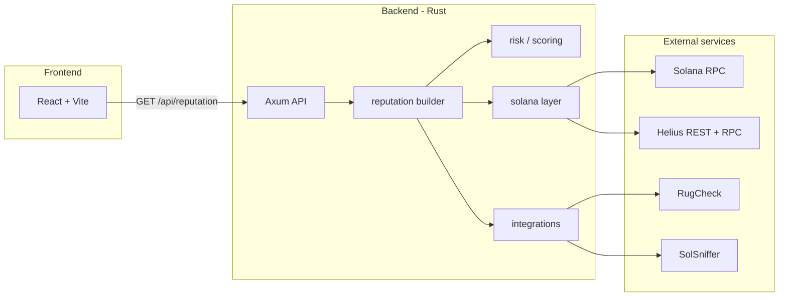

# WalletGuard — Project Documentation

WalletGuard is a **Solana wallet reputation / trust scoring** tool. You paste a wallet address, the backend analyzes on-chain behavior (and optional third-party token scans), and the UI shows a **1–100 trust score**, a **branded label** (Unverified → Guardian), and per-metric risk breakdowns.

The product direction is a **sellable reputation API** (`walletguard-v1`); the web app is a preview/demo client.

---

## What it does

| Capability | Description |
|------------|-------------|
| **Wallet check** | Validates a base58 Solana address and builds a full reputation report. |
| **Trust score** | Internal raw score (0–1400) mapped to a public **1–100** score plus a trust label. |
| **Risk metrics** | Eight parameters (age, tx count, bursts, spacing, balance, NFTs, tokens, DeFi) each rated `low` / `medium` / `high`. |
| **Improvement hints** | Actionable steps for metrics that are not low risk (except wallet age). |
| **Token scans** | Optional RugCheck + SolSniffer on a sample of held SPL mints. |
| **Session history** | Last 5 checks stored in the browser (`sessionStorage` only). |
| **On-chain program** | Separate Anchor program (`walletguard/`) to store scores on-chain — **not wired to the live API/UI yet**. |

---

## High-level architecture



---

## Repository layout

```
solana-walletguard/
├── backend/                 # Rust API (walletguard-api)
│   ├── src/
│   │   ├── main.rs          # Server, routes, AppState
│   │   ├── config.rs        # Env / scan modes
│   │   ├── analysis/        # Reputation pipeline, risk rules, improvements
│   │   ├── integrations/    # RugCheck, SolSniffer, TokenSniffer stubs
│   │   ├── models/          # API response types
│   │   ├── routes/          # HTTP handlers
│   │   └── solana/          # RPC, Helius, transactions, wallet data
│   ├── .env.example
│   └── Cargo.toml
├── frontend/                # React + TypeScript + Vite UI
│   └── src/
│       ├── App.tsx          # Main check flow
│       ├── components/      # MetricRow, RiskIcon
│       ├── hooks/           # useWalletHistory
│       ├── types/           # API TypeScript types
│       └── utils/           # normalizeReport (API → UI shape)
└── walletguard/             # Anchor on-chain program (experimental)
    └── programs/walletguard/
```

There is also a `backend/node_modules/` tree (legacy JS deps); the **active API is Rust** in `backend/src/`.

---

## How a wallet check works (end-to-end)

1. **User** enters an address in the frontend and clicks **Check wallet**.
2. **Frontend** calls `GET {VITE_API_URL}/api/reputation?address=...` (default `http://localhost:3001`).
3. **Backend** validates the address (32-byte base58 pubkey).
4. **Parallel fetch** (Tokio `try_join!`):
   - SOL balance (`getBalance`)
   - Transaction history (`get_transactions`)
   - SPL token accounts (`getTokenAccountsByOwner`)
5. **Optional** token risk scans (RugCheck / SolSniffer) on up to `MAX_TOKEN_SCANS` mints, unless `SKIP_EXTERNAL_SCANS=true`.
6. **Metrics** — eight `MetricAssessment` values from heuristics in `analysis/risk.rs`.
7. **Score** — `compute_reputation_score()` → `raw_to_trust_rating()` → 1–100 + label.
8. **JSON response** flattened for the UI (`ReputationResponse` + legacy fields).
9. **Frontend** runs `normalizeReport()` and renders score, label, metrics, warnings, token risks.

### Transaction history sources

| Mode | Tx metrics source | Wallet age source |
|------|-------------------|-------------------|
| **fast** (default) | Helius REST: recent ~100 txs | Helius `getTransactionsForAddress` (asc, limit 1) if available, else signature pagination |
| **balanced** | RPC signature pages (3 pages) | Same age logic, up to `MAX_AGE_SIGNATURE_PAGES` |
| **deep** | RPC signature pages (`MAX_SIGNATURE_PAGES`) | Same age logic |

**Wallet age** = time since **first successful on-chain activity** (oldest known signature timestamp).

**Known limitation:** Hyper-active wallets (more txs than `pages × page_size`) may not reach the true first transaction when Helius oldest-tx lookup fails and pagination hits the cap. The UI shows a warning when `wallet_age.age_capped` is true.

---

## Trust score and labels

### Pipeline

1. **Raw score** (`compute_reputation_score`) — starts at 200, adds/subtracts based on signals, clamped **0–1400**.
2. **Public score** (`raw_to_trust_rating`) — maps raw to **1–100**: `1 + (raw × 99 / 1400)`.
3. **Trust label** — branded tiers (not planet names):

| Score (1–100) | Label |
|---------------|--------|
| 1–20 | Unverified |
| 21–40 | Caution |
| 41–60 | Fair |
| 61–80 | Trusted |
| 81–94 | Strong |
| 95–100 | Guardian |

### Raw score factors (summary)

| Signal | Effect (examples) |
|--------|-------------------|
| Wallet age | +320 if ≥365d, +200 if ≥90d, …, −100 if unknown/zero |
| Tx count | +150 if ≥500, +100 if ≥100, −80 if 0 |
| Young wallet + burst | −180 if age &lt;14d and ≥15 txs/hour |
| Even spacing (young wallet) | +70 if CV ≤0.45 and low burst |
| SOL balance | +40 if ≥1 SOL, +15 if ≥0.1 SOL |
| Honeypot token | −250 |
| High-risk tokens | −40 each |

---

## Metrics (parameters)

Each metric has `id`, `label`, `value`, `risk`, `summary`.

| ID | What it measures |
|----|------------------|
| `wallet_age` | Days since first activity |
| `tx_count` | Successful txs (may show `N+` if scan capped) |
| `tx_burst` | Peak transactions in any 1-hour window |
| `tx_spacing` | Coefficient of variation of inter-tx intervals |
| `balance` | SOL balance |
| `nft_count` | Estimated NFTs (0 decimals, amount = 1) |
| `token_risk` | RugCheck / SolSniffer flags on held tokens |
| `defi_exposure` | **Estimate** from tx count (`len/50`, cap 200) — not full program parsing |

**Young wallet + high velocity:** If age &lt; 14 days and txs/day &gt; 100, tx_count is rated **high** (common sybil/bot pattern).

---

## Backend API

### Stack

- **Rust** 2021, **Tokio**, **Axum** 0.7
- **reqwest** (HTTP to Helius REST, RugCheck, SolSniffer)
- **serde** / **serde_json**
- **dotenvy** — loads `backend/.env` at startup
- **tracing** — structured logs

### Endpoints

| Method | Path | Description |
|--------|------|-------------|
| `GET` | `/health` | Returns `ok` |
| `GET` | `/api/reputation?address={base58}` | Full reputation report |

### Example response shape (conceptual)

```json
{
  "address": "...",
  "reputation_score": 72,
  "tier": "Trusted",
  "trust_label": "Trusted",
  "balance": { "sol": 1.23 },
  "tx_stats": { "count": 450, "capped": false, "max_per_hour": 12 },
  "wallet_age": {
    "days": 120,
    "days_precise": 120.5,
    "first_activity_unix": 1700000000,
    "age_capped": false
  },
  "nft_stats": { "count": 3 },
  "defi_exposure": { "total_usd": 0, "interaction_count": 9 },
  "metrics": [ ... ],
  "improvement_steps": [ ... ],
  "token_risks": [ ... ],
  "integrations": {
    "scan_mode": "fast",
    "max_signature_pages": 1,
    "max_age_signature_pages": 50,
    "age_source": "helius_gtfa",
    "tx_scan_source": "helius",
    "helius_configured": true
  },
  "api_version": "walletguard-v1"
}
```

### Errors

| Status | When |
|--------|------|
| 400 | Missing/invalid address |
| 500 | RPC failure, internal error |

---

## Solana layer (`backend/src/solana/`)

| Module | Role |
|--------|------|
| `rpc.rs` | JSON-RPC client with retries on 429 / rate limits |
| `wallet.rs` | Balance + token accounts |
| `transactions.rs` | History aggregation, age, burst, spacing stats |
| `helius.rs` | Helius REST recent txs + `getTransactionsForAddress` (oldest tx) |
| `mod.rs` | Address validation (bs58, 32 bytes) |

### RPC methods used

- `getBalance`
- `getTokenAccountsByOwner` (SPL Token program)
- `getSignaturesForAddress` (paginated)
- `getTransaction` (fallback blockTime)
- `getTransactionsForAddress` (Helius-only, sort `asc`, limit 1)

### Helius

- **REST:** `https://api.helius.xyz/v0/addresses/{address}/transactions` — fast recent history.
- **RPC:** `getTransactionsForAddress` — intended one-call oldest tx (requires Helius RPC URL + API key).

---

## External integrations (`backend/src/integrations/`)

| Service | Purpose | Required |
|---------|---------|----------|
| **Helius** | Fast tx history + wallet age GTFA | Recommended (`HELIUS_API_KEY`, Helius RPC URL) |
| **RugCheck** | Token rug/honeypot signals | Optional (`RUGCHECK_API_KEY`) |
| **SolSniffer** | Token snifscore | Optional (`SOLSNIFFER_API_KEY`) |
| **TokenSniffer** | EVM-focused; stub for future | Optional |

Scans run only when `SKIP_EXTERNAL_SCANS` is false and the wallet holds SPL mints (disabled by default in **fast** mode).

---

## Frontend (`frontend/`)

### Stack

- **React 19**, **TypeScript**, **Vite 8**
- **@solana/web3.js** — address validation (`PublicKey`)
- Wallet adapter packages are in `package.json` but the main flow is **address paste**, not wallet connect.

### Key files

| File | Purpose |
|------|---------|
| `App.tsx` | Fetch report, render score / metrics / warnings |
| `utils/normalizeReport.ts` | Maps API JSON (snake_case or camelCase) to UI types |
| `components/MetricRow.tsx` | Single metric + expandable improvement steps |
| `hooks/useWalletHistory.ts` | Last 5 checks in `sessionStorage` |

### Env

| Variable | Default | Description |
|----------|---------|-------------|
| `VITE_API_URL` | `http://localhost:3001` | Backend base URL |

---

## On-chain program (`walletguard/`)

**Anchor** program (`declare_id!` on localnet: `CzFJg6mnbgM29hSzMCL1Bvp1gZdfhi6pBq1a3smVtDhx`).

| Instruction | Purpose |
|-------------|---------|
| `initialize_wallet` | Create PDA storing score, tier string, risk level |
| `update_wallet_score` | Owner updates score |
| `get_wallet_score` | Read-only log of stored data |

The on-chain tier strings in the program README still mention legacy planet names; the **live API** uses the new 1–100 + WalletGuard labels. **The program is not integrated** with the Rust API or React app in the current demo.

---

## Configuration (`backend/.env`)

Copy `backend/.env.example` → `backend/.env`. Restart the API after changes.

### Core

| Variable | Default | Description |
|----------|---------|-------------|
| `PORT` | `3001` | API listen port |
| `SOLANA_RPC_URL` | public mainnet | Primary RPC (balance, tokens) |
| `SOLANA_HISTORY_RPC_URL` | same as above | Signature / age pagination |
| `HELIUS_API_KEY` | — | Helius REST + auto `api-key` on RPC URLs |

### Scan behavior

| Variable | Default | Description |
|----------|---------|-------------|
| `SCAN_MODE` | `fast` | `fast` \| `balanced` \| `deep` |
| `SKIP_EXTERNAL_SCANS` | `true` in fast | RugCheck / SolSniffer |
| `HELIUS_TX_LIMIT` | `100` | Recent txs from Helius REST |
| `SIGNATURE_PAGE_SIZE` | `1000` | RPC page size |
| `MAX_SIGNATURE_PAGES` | 1 / 3 / 15+ | Tx scan depth by mode |
| `MAX_AGE_SIGNATURE_PAGES` | `50` | Age-only pagination fallback |
| `SIGNATURE_PAGE_DELAY_MS` | 0 / 150 / 300 | Delay between pages |
| `RPC_MAX_RETRIES` | `3` | RPC retry count |
| `RPC_RETRY_BASE_MS` | `800` | Backoff base |

### Scan modes

| Mode | `max_signature_pages` | Typical latency |
|------|-------------------------|-----------------|
| `fast` | 1 | ~2–5 s |
| `balanced` | 3 | ~5–10 s |
| `deep` | `MAX_SIGNATURE_PAGES` (env) | Slow, more complete tx count |

**Note:** Wallet age uses a **separate** page limit (`MAX_AGE_SIGNATURE_PAGES`) and does not require `deep` mode if Helius oldest-tx works.

---

## Running locally

### Backend

```bash
cd backend
cp .env.example .env
# Edit .env: set SOLANA_RPC_URL and HELIUS_API_KEY (recommended)
cargo run
```

Logs include `scan config` (mode, page limits, Helius GTFA availability).

### Frontend

```bash
cd frontend
npm install
npm run dev
```

Open the Vite URL (usually `http://localhost:5173`). Ensure `VITE_API_URL` points at the API.

### Docker (backend)

```bash
cd backend
docker build -t walletguard-api .
docker run -p 3001:3001 --env-file .env walletguard-api
```

---

## Design goals and future API product

- **Proprietary scoring** — WalletGuard-branded 1–100 score and labels (not third-party planet tiers).
- **API-first** — `api_version: walletguard-v1`, stable JSON for integrators.
- **Planned sellable API** — Same backend endpoint pattern; frontend is a reference client.

### Current gaps / tech debt

- Wallet age on **very active** wallets may be wrong until Helius GTFA works or pagination limits are raised.
- DeFi exposure is a **rough estimate**, not instruction-level DeFi detection.
- `defi_exposure.total_usd` is always `0` in the API today.
- On-chain program is **out of sync** with API labels and not production-linked.
- `backend/node_modules` suggests an older Node prototype; production path is **Rust only**.

---

## Quick reference: what uses what

| Layer | Technologies |
|-------|----------------|
| **UI** | React, TypeScript, Vite, CSS |
| **API** | Rust, Axum, Tokio, reqwest, serde, dotenvy, chrono |
| **Chain read** | Solana JSON-RPC, Helius REST + Helius RPC extensions |
| **Token risk** | RugCheck API, SolSniffer API |
| **On-chain (optional)** | Anchor, Solana program Rust |
| **Storage (UI only)** | `sessionStorage` for check history |

---

## Related files

- `backend/README.md` — short API run/build notes  
- `backend/.env.example` — all environment variables  
- `frontend/README.md` — Vite template notes (not WalletGuard-specific)
