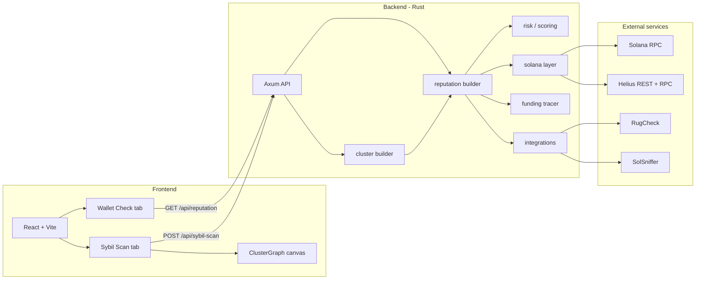

# WalletGuard — Project Documentation

WalletGuard is a **Solana wallet activity / reputation scoring** tool. You paste a wallet address (or a batch of addresses), the backend analyzes on-chain behavior (and optional third-party token scans), and the UI shows a **1–100 activity score**, an **activity band**, per-metric risk breakdowns, **funding-source classification**, and **sybil cluster detection** for batch scans.

The API returns versioned heuristic reports (`walletguard-v2`, scoring `activity-v3`). Results describe observed activity and provider evidence, not verified ownership or wallet safety.

---

## What it does

| Capability | Description |
|------------|-------------|
| **Wallet check** | Validates a base58 Solana address and builds a full reputation report. |
| **Activity score** | Internal raw score (0–710) mapped to a public **1–100** score plus an activity band. |
| **Risk metrics** | Eight parameters (age, tx count, bursts, spacing, balance, NFTs, tokens, DeFi) each rated `low` / `medium` / `high` / `unknown`. |
| **Funding source** | Traces the oldest tx and classifies the first SOL inflow sender as `cex`, `bridge`, `wallet`, or `unknown`. |
| **Sybil scan** | Batch scan up to **10** addresses; groups wallets that share the same funding address into clusters. |
| **Improvement hints** | Actionable steps for metrics that are not low risk (except wallet age). |
| **Token scans** | Optional RugCheck + SolSniffer on a sample of held SPL mints. |
| **Session history** | Last 5 single-wallet checks stored in the browser (`sessionStorage` only). |
| **Network graph** | Canvas visualization of clusters and wallets with no flags detected on the Sybil Scan tab. |
| **On-chain program** | Historical Anchor experiment, removed from this branch; no live contract integration. |

---

## High-level architecture


```mermaid
flowchart LR
  subgraph client [Frontend]
    UI[React + Vite]
    WC[Wallet Check tab]
    SS[Sybil Scan tab]
    CG[ClusterGraph canvas]
    UI --> WC
    UI --> SS
    SS --> CG
  end
  subgraph api [Backend - Rust]
    AX[Axum API]
    REP[reputation builder]
    CLU[cluster builder]
    RISK[risk / scoring]
    SOL[solana layer]
    FUND[funding tracer]
    INT[integrations]
  end
  subgraph external [External services]
    RPC[Solana RPC]
    HEL[Helius REST + RPC]
    RUG[RugCheck]
    SNI[SolSniffer]
  end
  WC -->|GET /api/reputation| AX
  SS -->|POST /api/sybil-scan| AX
  AX --> REP
  AX --> CLU
  REP --> RISK
  REP --> SOL
  REP --> FUND
  REP --> INT
  CLU --> REP
  SOL --> RPC
  SOL --> HEL
  INT --> RUG
  INT --> SNI
```

---

## Repository layout

```
solana-walletguard/
├── backend/                 # Rust API (walletguard-api)
│   ├── src/
│   │   ├── main.rs          # Server, routes, AppState, CORS
│   │   ├── config.rs        # Env / scan modes / rate limits
│   │   ├── analysis/
│   │   │   ├── reputation.rs
│   │   │   ├── cluster.rs   # In-memory funder clustering
│   │   │   ├── risk.rs
│   │   │   └── improvements.rs
│   │   ├── integrations/
│   │   ├── models/
│   │   ├── routes/
│   │   │   ├── wallet.rs    # GET /api/reputation
│   │   │   └── sybil.rs     # POST /api/sybil-scan
│   │   └── solana/
│   │       ├── rpc.rs       # JSON-RPC + global concurrency gate
│   │       ├── wallet.rs
│   │       ├── transactions.rs
│   │       ├── helius.rs
│   │       └── funding.rs   # First SOL inflow / CEX–bridge labels
│   ├── .env.example
│   └── Cargo.toml
├── frontend/
│   ├── vite.config.ts       # Dev proxy /api → backend
│   └── src/
│       ├── App.tsx          # Tabs: Wallet Check | Sybil Scan
│       ├── components/
│       │   ├── MetricRow.tsx
│       │   ├── SybilScanner.tsx
│       │   └── ClusterGraph.tsx   # Canvas network graph
│       ├── hooks/
│       ├── types/api.ts
│       └── utils/normalizeReport.ts
```

**Note:** The original Anchor experiment is available in Git history (`21611eb:walletguard/`). It was removed in `3fc5c77` and is absent from this checkout.

---

## How a wallet check works (end-to-end)

1. **User** enters an address on the **Wallet Check** tab and clicks **Check wallet**.
2. **Frontend** calls `GET /api/reputation?address=...` (same-origin via Vite proxy in dev, or `VITE_API_URL` when set).
3. **Backend** validates the address (32-byte base58 pubkey).
4. **Parallel fetch** (`tokio::join!`):
   - SOL balance (`getBalance`)
   - Transaction history (`get_transactions`)
   - SPL token accounts (`getTokenAccountsByOwner`)
   - Funding source (`get_funding_source`)
5. **Optional** token risk scans (RugCheck / SolSniffer) on up to `MAX_TOKEN_SCANS` mints, unless `SKIP_EXTERNAL_SCANS=true`.
6. **Metrics** — eight `MetricAssessment` values from `analysis/risk.rs`.
7. **Score** — `compute_reputation_score()` → `raw_to_trust_rating()` → 1–100 + label.
8. **JSON response** includes `funding_source` plus flattened legacy fields for the UI.
9. **Frontend** runs `normalizeReport()` and renders score, label, metrics, warnings, token risks.

### Transaction history sources

| Mode | Tx metrics source | Wallet age source |
|------|-------------------|-------------------|
| **fast** (default) | Helius REST: recent ~100 txs | Helius `getTransactionsForAddress` (asc, limit 1) if available, else signature pagination |
| **balanced** | RPC signature pages (3 pages) | Same age logic, up to `MAX_AGE_SIGNATURE_PAGES` |
| **deep** | RPC signature pages (`MAX_SIGNATURE_PAGES`) | Same age logic |

**Wallet age** = time since **first successful on-chain activity** (oldest known signature timestamp).

**Known limitation:** Hyper-active wallets (more txs than `pages × page_size`) may not reach the true first transaction when Helius oldest-tx lookup fails and pagination hits the cap. The UI shows a warning when `wallet_age.age_capped` is true.

---

## Funding source tracer (`backend/src/solana/funding.rs`)

For each wallet, the API attempts to find **who first funded it with SOL**.

### Steps

1. **Oldest signature** — Prefer Helius `getTransactionsForAddress` (sort `asc`, limit 1). Fallback: paginate `getSignaturesForAddress` (capped by `FUNDING_MAX_SIGNATURE_PAGES`, delayed by `FUNDING_PAGE_DELAY_MS`).
2. **Parse oldest tx** — `getTransaction` with `jsonParsed`; find first system `transfer` or `createAccount` where the wallet is the destination.
3. **Classify sender**:
   - **`cex`** — sender in a hardcoded set of labeled Binance / Coinbase / Kraken hot wallets (mainnet; not exhaustive).
   - **`bridge`** — tx touches Wormhole or Allbridge program IDs, or sender is a bridge program address.
   - **`wallet`** — any other identified sender.
   - **`unknown`** — no history, no inflow, or RPC failure (returns `confidence: low`).

### Response field

```json
"funding_source": {
  "source_type": "cex",
  "source_address": "9WzDXwBbmkg8ZTbNMqUxvQRAyrZzDsGYdLVL9zYtAWWM",
  "confidence": "high"
}
```

`confidence` is `high` for CEX matches, `medium` for bridge/wallet with a known sender, `low` for unknown.

---

## Sybil scan and clustering

### API: `POST /api/sybil-scan`

**Request:**

```json
{
  "addresses": ["addr1", "addr2", "addr3"]
}
```

- **Max 10** addresses per request.
- Each address is validated (base58, 32 bytes).
- Reputation reports are built **concurrently** with a wallet-level cap (`SYBIL_SCAN_CONCURRENCY`, default **2**).
- All JSON-RPC calls share a global in-flight cap (`RPC_GLOBAL_CONCURRENCY`, default **6**).

**Response:**

```json
{
  "wallets": [ /* ReputationResponse per address */ ],
  "clusters": [
    {
      "cluster_id": "a1b2c3d4",
      "funding_address": "Funder1111...",
      "members": ["walletA", "walletB"],
      "suspicion": "medium",
      "reasons": [
        "3 wallets share the same funding source",
        "first observed activity falls within the same 7-day window"
      ]
    }
  ],
  "total_scanned": 10,
  "flagged": 3
}
```

- **`flagged`** — count of unique wallets in a cluster or with individual metric/token flags. A low score alone does not count.
- **`cluster_id`** — first 8 hex chars of SHA-256(`funding_address`).

### Clustering logic (`backend/src/analysis/cluster.rs`)

1. Group wallets by `funding_source.source_address` when set; exclude classified CEX/bridge/unknown sources and deduplicate members.
2. **Cluster** = 2+ wallets with the same funder.
3. **Suspicion** by size:
   - 2 wallets → `low`
   - 3–9 → `medium`
   - 10+ → `high`
4. Only when all members have resolved, uncapped age data, if `first_activity_unix` values span ≤ **7 days**, add reason *"first observed activity falls within the same 7-day window"* and bump suspicion one level (`low`→`medium`, else→`high`).

Clusters are computed **in memory** after all wallet reports finish; no persistence.

---

## Activity score and labels

### Pipeline

1. **Raw score** (`compute_reputation_score`) — starts at 200, adds/subtracts based on signals, clamped **0–710**.
2. **Public score** (`raw_to_trust_rating`) — maps raw to **1–100**: `1 + (raw × 99 / 710)`.
**Scoring version:** `activity-v3` scales to the attainable maximum of 710. For example, 660 raw points maps to 93/100. The weights and thresholds have not been calibrated against a labeled dataset. Scores are not safety probabilities.

Token-provider findings are separate from the score in `activity-v3`; they still appear as individual review signals. Low activity alone is not an individual flag.

3. **Activity band**:

| Score (1–100) | Label |
|---------------|--------|
| 1–20 | Very limited activity |
| 21–40 | Limited activity |
| 41–60 | Moderate activity |
| 61–80 | Established activity |
| 81–100 | Extensive activity |

### Raw score factors (summary)

| Signal | Effect (examples) |
|--------|-------------------|
| Wallet age | +320 if ≥365d, +200 if ≥90d, …, −100 if unknown/zero |
| Tx count | +150 if ≥500, +100 if ≥100, −80 if 0 |
| Young wallet + burst | −180 if age &lt;14d and ≥15 txs/hour |
| Even spacing (young wallet) | +70 if CV ≤0.45 and low burst |
| SOL balance | +40 if ≥1 SOL, +15 if ≥0.1 SOL |
| Token findings | Reported separately; no activity-score penalty |

---

## Metrics (parameters)

Each metric has `id`, `label`, `value`, `risk`, `summary`. Risk `unknown` means not assessed or insufficient evidence; it is not a medium/high flag. Burst assessment requires known age and at least two timed transactions; spacing needs at least three. No spacing bonus is awarded without usable timing evidence.

| ID | What it measures |
|----|------------------|
| `wallet_age` | Days since first activity |
| `tx_count` | Successful transactions sampled or observed; never presented as a verified lifetime total |
| `tx_burst` | Peak transactions in any 1-hour window |
| `tx_spacing` | Coefficient of variation of inter-tx intervals |
| `balance` | SOL balance |
| `nft_count` | Informational legacy SPL estimate (0 decimals, amount = 1), risk `unknown`; no collection verification |
| `token_risk` | RugCheck / SolSniffer flags on held tokens |
| `defi_exposure` | Not assessed; interaction count and USD exposure are null |

**Young wallet + high velocity:** If age &lt; 14 days and txs/day &gt; 100, tx_count is rated **high** (common sybil/bot pattern).

---

## Backend API

### Stack

- **Rust** 2021, **Tokio**, **Axum** 0.7
- **reqwest** (HTTP to Helius REST, RugCheck, SolSniffer)
- **serde** / **serde_json**, **sha2** (cluster IDs)
- **dotenvy** — loads `backend/.env` at startup
- **tracing** — structured logs
- **tower-http** — permissive CORS

### Endpoints

| Method | Path | Description |
|--------|------|-------------|
| `GET` | `/health` | Returns `ok` |
| `GET` | `/api/reputation?address={base58}` | Full reputation report for one wallet |
| `POST` | `/api/sybil-scan` | Batch reputation + cluster analysis (JSON body) |

### Example single-wallet response (excerpt)

```json
{
  "address": "...",
  "reputation_score": 76,
  "tier": "Established activity",
  "trust_label": "Established activity",
  "balance": { "sol": 1.23 },
  "tx_stats": { "count": 100, "capped": false, "sampled": true, "max_per_hour": 12 },
  "wallet_age": {
    "days": 120,
    "days_precise": 120.5,
    "first_activity_unix": 1700000000,
    "age_capped": false
  },
  "funding_source": {
    "source_type": "cex",
    "source_address": "9WzDXwBbmkg8ZTbNMqUxvQRAyrZzDsGYdLVL9zYtAWWM",
    "confidence": "high"
  },
  "metrics": [],
  "improvement_steps": [],
  "token_risks": [],
  "integrations": {
    "scan_mode": "fast",
    "max_signature_pages": 1,
    "max_age_signature_pages": 50,
    "age_source": "helius_gtfa",
    "tx_scan_source": "helius",
    "helius_configured": true
  },
  "api_version": "walletguard-v2",
  "scoring_version": "activity-v3",
  "defi_exposure": { "total_usd": null, "interaction_count": null },
  "coverage": {
    "history_source": "helius",
    "timed_transactions": 100,
    "sample_start_unix": 1700000000,
    "sample_end_unix": 1710000000,
    "token_scans": {
      "status": "skipped",
      "held_mints": 5,
      "selected_mints": 0,
      "checked_mints": 0,
      "fully_checked_mints": 0,
      "rugcheck_checked": 0,
      "solsniffer_checked": 0,
      "solsniffer_enabled": false
    }
  }
}
```

### Errors

| Status | When |
|--------|------|
| 400 | Missing/invalid address, empty sybil batch, &gt;10 addresses |
| 413 | Request body exceeds 8 KiB |
| 429 | Request or fresh-scan quota exhausted; Retry-After included |
| 503 | Active-request limit reached |
| 504 | Wallet or request deadline reached |
| 500 | RPC failure after retries, internal error (details withheld) |

---

## Solana layer (`backend/src/solana/`)

| Module | Role |
|--------|------|
| `rpc.rs` | JSON-RPC with retries on 429 / `-32429`; optional global concurrency semaphore |
| `wallet.rs` | Balance + token accounts |
| `transactions.rs` | History aggregation, age, burst, spacing stats |
| `helius.rs` | Helius REST + `getTransactionsForAddress` (oldest tx / signature) |
| `funding.rs` | First SOL inflow tracer + CEX/bridge classification |
| `mod.rs` | Address validation (bs58, 32 bytes) |

### RPC methods used

- `getBalance`
- `getTokenAccountsByOwner` (SPL Token program)
- `getSignaturesForAddress` (paginated; funding fallback)
- `getTransaction` (`jsonParsed`)
- `getTransactionsForAddress` (Helius-only, sort `asc`, limit 1)

### Helius

- **REST:** `https://api.helius.xyz/v0/addresses/{address}/transactions` — fast recent history.
- **RPC:** `getTransactionsForAddress` — one-call oldest tx/signature (requires Helius RPC URL + `HELIUS_API_KEY`).

**Strongly recommended** for sybil scans and funding trace to avoid public-RPC rate limits.

---

## External integrations (`backend/src/integrations/`)

| Service | Purpose | Required |
|---------|---------|----------|
| **Helius** | Fast tx history, wallet age, funding oldest-tx | Recommended |
| **RugCheck** | Token rug/honeypot signals | Optional |
| **SolSniffer** | Token snifscore | Optional |

Scans run only when `SKIP_EXTERNAL_SCANS` is false and the wallet holds nonzero legacy SPL mints (disabled by default in **fast** mode).

`coverage.token_scans` records `status`, `held_mints`, `selected_mints`, `checked_mints`, `fully_checked_mints`, provider success counts, whether SolSniffer is enabled, and safe per-provider `issues` (mint, code, HTTP status and message). Status is `skipped`, `no_holdings`, `timed_out`, `unavailable`, `partial` or `complete`. A mint is fully checked only when all enabled providers returned usable data. Complete refers only to detected held legacy SPL mints and enabled providers.

RugCheck uses its public summary endpoint, a FluxRPC RugCheck key via `X-API-KEY`, or an explicitly `Bearer `-prefixed JWT; a credential rejected with 401 on the official endpoint triggers one public retry, exposed as `public_fallback`. SolSniffer uses `https://solsniffer.com/api/v2/token/{mint}`, `X-API-KEY`, and `tokenData.score`. Its Free plan is 100 calls/month; one-hour per-token caching, checked timestamps, a per-run request guard and ten-minute access/quota cooldown reduce repeat requests. These process-local controls reset on restart; see [quota details](#service-limits). See [provider setup](backend/README.md#token-provider-setup-and-diagnostics).

A shared eight-second scan deadline preserves completed provider results. High-risk results remain visible even if later checks fail or time out. Incomplete coverage with no returned flags is `unknown`, not low risk. Completed scans say “No flags detected,” never “Clear.”

---

## Frontend (`frontend/`)

### Stack

- **React 19**, **TypeScript**, **Vite 8**
- **bs58** — validates that a pasted address decodes to 32 bytes
- **HTML Canvas** — cluster network graph (no chart libraries)
- Address-paste flow only; wallet adapters, Anchor and the full Solana browser SDK are removed.

### UI tabs (`App.tsx`)

| Tab | Component | Behavior |
|-----|-----------|----------|
| **Wallet Check** | Existing flow | Single address, reputation report, session history sidebar |
| **Sybil Scan** | `SybilScanner.tsx` | Paste up to 10 addresses (newline-separated), batch scan, clusters + graph |

### Key files

| File | Purpose |
|------|---------|
| `App.tsx` | Tab switcher, Wallet Check layout |
| `components/SybilScanner.tsx` | Batch input, `POST /api/sybil-scan`, summary, cluster cards, list with no flags detected |
| `components/ClusterGraph.tsx` | 700×420 canvas: cluster hubs, member orbits, wallets with no flags detected, legend |
| `components/MetricRow.tsx` | Single metric + evidence review notes |
| `components/ScanCoverage.tsx` | Transaction sample, provider outcomes and funding availability on both screens |
| `utils/normalizeReport.ts` | Maps API JSON to UI types (Wallet Check) |
| `hooks/useWalletHistory.ts` | Last 5 checks in `sessionStorage` |
| `types/api.ts` | `ReputationReport`, `WalletCluster`, `SybilScanResponse`, etc. |

### Sybil Scan UI flow

1. User pastes addresses (one per line) and clicks **Scan**.
2. Loading state while the batch runs (can take minutes for many addresses).
3. **Summary bar** — `X wallets scanned, Y flagged in Z clusters`.
4. **Cluster graph** (when any clusters or wallets with no flags detected exist) — canvas visualization.
5. **Cluster cards** — suspicion badge, funder, members, reasons.
6. **No flags detected** — addresses with neither cluster membership nor elevated individual risk flags.
7. Cache the complete response for five minutes. Reuse only for the same address set; partial wallet cache hits cannot establish cross-wallet relationships.

### Cluster graph (`ClusterGraph.tsx`)

- **Center nodes** (22px) — shared funding address, colored by suspicion (red / orange / yellow).
- **Member nodes** (12px, purple) — orbit center at 70px radius.
- **Unflagged nodes** (10px, green) — grouped on the right, no edges.
- Labels truncated to `abcd…wxyz` (9px monospace).
- Legend in the bottom-left corner.

### Dev networking (CORS / proxy)

Vite proxies `/api` and `/health` to `http://127.0.0.1:3001` (`vite.config.ts`). The frontend defaults to **relative URLs** (`VITE_API_URL` unset), so the browser talks to the Vite dev server and avoids CORS on `POST /api/sybil-scan`.

| Variable | Default (dev) | Description |
|----------|---------------|-------------|
| `VITE_API_URL` | *(empty)* | Backend base URL; leave empty for Vite proxy. Set for production or direct API access. |

Backend CORS allows only origins listed in `CORS_ALLOWED_ORIGINS`, with GET/POST and Content-Type preflight support. Empty configuration relies on same-origin access. The root Docker image serves the production frontend and API from one origin; Render provides HTTPS. Separate hosting can still use a build-time `VITE_API_URL`.

---

## Historical on-chain experiment

Analysis runs off-chain. No on-chain program, wallet connection or transaction signing is required.

## Configuration (`backend/.env`)

Copy `backend/.env.example` → `backend/.env` on first setup; preserve an existing file. Restart the API after changes. Tables show code defaults; the example overrides some values.

### Core

| Variable | Default | Description |
|----------|---------|-------------|
| `PORT` | `3001` | API listen port |
| `SOLANA_RPC_URL` | public mainnet | Primary RPC (balance, tokens) |
| `SOLANA_HISTORY_RPC_URL` | same as above | Signature / age / funding pagination |
| `HELIUS_API_KEY` | — | Helius REST + auto `api-key` on Helius history RPC hosts |
| `CORS_ALLOWED_ORIGINS` | empty | Comma-separated frontend origins for cross-origin hosting |

### Scan behavior

| Variable | Default | Description |
|----------|---------|-------------|
| `SCAN_MODE` | `fast` | `fast` \| `balanced` \| `deep` |
| `SKIP_EXTERNAL_SCANS` | `true` in fast | RugCheck / SolSniffer |
| `HELIUS_TX_LIMIT` | `100` | Recent txs from Helius REST |
| `SIGNATURE_PAGE_SIZE` | `1000` | RPC page size |
| `MAX_SIGNATURE_PAGES` | 1 / 3 / 15+ | Tx scan depth by mode |
| `MAX_AGE_SIGNATURE_PAGES` | `50` | Wallet-age pagination fallback |
| `SIGNATURE_PAGE_DELAY_MS` | 0 / 150 / 300 | Delay between tx-history pages |
| `RPC_MAX_RETRIES` | `3` | RPC retry count on rate limit |
| `RPC_RETRY_BASE_MS` | `800` | Exponential backoff base (min 1.5s on retry) |

### Batch scan and funding

| Variable | Default | Description |
|----------|---------|-------------|
| `SYBIL_SCAN_CONCURRENCY` | `2` | Max wallets scanned in parallel |
| `RPC_GLOBAL_CONCURRENCY` | `6` | Max simultaneous JSON-RPC calls |
| `FUNDING_MAX_SIGNATURE_PAGES` | `50` | Funding trace pagination cap (if no Helius GTFA) |
| `FUNDING_PAGE_DELAY_MS` | `250` | Delay between funding signature pages |

### Scan modes

| Mode | `max_signature_pages` | Typical latency (single wallet) |
|------|-------------------------|----------------------------------|
| `fast` | 1 | ~2–5 s |
| `balanced` | 3 | ~5–10 s |
| `deep` | `MAX_SIGNATURE_PAGES` (env) | Slow, more complete tx count |

**Note:** Wallet age and funding oldest-tx prefer **Helius GTFA** (one RPC call) and do not require `deep` mode when Helius is configured.

### Sybil scan tips

- Use a **paid Helius** (or similar) RPC — public endpoints will return **429** under batch load.
- Keep `SYBIL_SCAN_CONCURRENCY=1` if you still hit rate limits.
- Scan **2–5 addresses** per request for faster iteration; max is 10.

---

## Running locally

### Backend

```bash
cd backend
cp .env.example .env
# Edit .env: HELIUS_API_KEY + Helius RPC URLs (strongly recommended)
cargo run --locked
```

Logs include `scan config` (mode, page limits, Helius GTFA, sybil/RPC concurrency).

Verify: `curl http://127.0.0.1:3001/health` → `ok`

### Frontend

```bash
cd frontend
npm ci
npm run dev
```

Open `http://localhost:5173` (or the URL Vite prints).

- **Do not** set `VITE_API_URL` for local dev unless you need cross-origin access; the Vite proxy handles `/api`.
- If you change `vite.config.ts`, **restart** the dev server.
- Restart the **backend** after `.env` changes.

### Example sybil scan (curl)

```bash
curl -s -X POST http://127.0.0.1:3001/api/sybil-scan \
  -H "Content-Type: application/json" \
  -d '{"addresses":["ADDR1","ADDR2","ADDR3"]}' | jq .
```

### Docker (backend)

```bash
cd backend
docker build -t walletguard-api .
docker run -p 3001:3001 --env-file .env walletguard-api
```

---

## Design goals and future API product

- **Heuristic activity scoring** — 1–100 score and activity bands; not an empirically validated safety assessment.
- **API-first** — versioned JSON reports; current `api_version: walletguard-v2`, `scoring_version: activity-v3`.
- **Sybil intelligence** — Shared-funder clustering for batch due diligence.
- **Planned sellable API** — Same backend endpoints; frontend is a reference client.

### Current gaps / tech debt

- Wallet age on **very active** wallets may be wrong until Helius GTFA works or pagination limits are raised.
- Funding **CEX list** is a small static mainnet set, not a live labels feed.
- DeFi instruction analysis and USD exposure are not implemented; both values are null.
- Sybil clusters depend on **funding_source.source_address**; unknown funders are not clustered.
- No active on-chain program; it exists only in Git history.
- Token coverage only includes detected legacy SPL holdings and the enabled providers; Token-2022 and compressed NFTs are not covered.
- Process-local server cache, quotas, concurrency bounds and deadlines are implemented. There is no login or distributed quota store; see [service limits](#service-limits).
- The original Node backend and its tracked dependencies were removed; the backend is Rust only.

---

## Quick reference: what uses what

| Layer | Technologies |
|-------|----------------|
| **UI** | React, TypeScript, Vite, CSS, HTML Canvas |
| **API** | Rust, Axum, Tokio, reqwest, serde, dotenvy, chrono, sha2 |
| **Chain read** | Solana JSON-RPC, Helius REST + Helius RPC extensions |
| **Token risk** | RugCheck API, SolSniffer API |
| **Storage** | Bounded server memory; `sessionStorage` for history, `localStorage` for five-minute report/batch reuse |

---

## Related files

- `backend/README.md` — short API run/build notes  
- `backend/.env.example` — all environment variables  
- `frontend/README.md` — frontend setup, cache behavior and checks

## Public beta deployment

See [deployment instructions](README.md#deployment) for the free hosting preset, bounded cache/admission model, cancellation, privacy, CI and launch gates. `generated_at` on each report identifies server report age. Browser Refresh respects the server cache.

## Service limits

The API is intended to run as one instance. Cache entries, IP request windows and scan budgets are bounded in memory and reset on restart. They limit work, not provider billing.

| Setting | API default | Render preset |
|---|---:|---:|
| Batch entries / request body | 10 / 8 KiB | 10 / 8 KiB |
| `MAX_ACTIVE_REQUESTS` | 8 | 4 |
| `MAX_ACTIVE_SCANS` | 4 | 2 |
| `IP_SCAN_UNITS_PER_MINUTE` | 30 | 30 |
| `FRESH_SCANS_PER_HOUR` | 120 | 20 |
| `CACHE_TTL_SECONDS` | 300 | 900 |
| `CACHE_MAX_WALLETS` | 256 | 128 |
| `WALLET_TIMEOUT_SECONDS` | 45 | 45 |
| `REQUEST_TIMEOUT_SECONDS` | 120 | 120 |
| `MAX_TOKEN_SCANS` | 3 | 2 |
| `SOLSNIFFER_MAX_CALLS_PER_RUN` | 90 | 90 |

A single-wallet request costs one request unit; a batch costs ten, even when cached or invalid. Fresh-scan budget is charged before upstream work, including failed attempts. Concurrent duplicate wallet requests reuse a completed result. Errors are not cached. Refresh bypasses the browser cache but respects server cache and quotas; `generated_at` identifies the report's generation time.

SolSniffer caches up to 100 successful token results for one hour and exposes `solsniffer_checked_at`. Duplicate mints share a request; expired results are not reused. Its per-run request guard includes failures and cancellation, with a maximum setting of 100. HTTP 401/402/403/429 pauses new calls for ten minutes; cached results and other providers remain available. These limits do not persist across process restarts or replace the provider's monthly quota.

Public RugCheck requests are paced at least 1.1 seconds apart. Waiting counts toward the shared eight-second token deadline, and completed results survive subsequent failures/timeouts.

429 responses include `Retry-After`; 503 indicates admission is full; 504 indicates a deadline. Batch tasks abort when their request fails or times out. Already-sent provider requests may still count toward provider usage. SIGTERM drains active requests within their existing deadlines.

Forwarding headers are ignored unless the socket peer is listed in `TRUSTED_PROXY_IPS`. Only configure that setting for a controlled proxy that overwrites `X-WalletGuard-Client-IP`; otherwise leave it empty. Clients behind a shared proxy can share the peer quota. `/health` checks process liveness, not provider availability.
